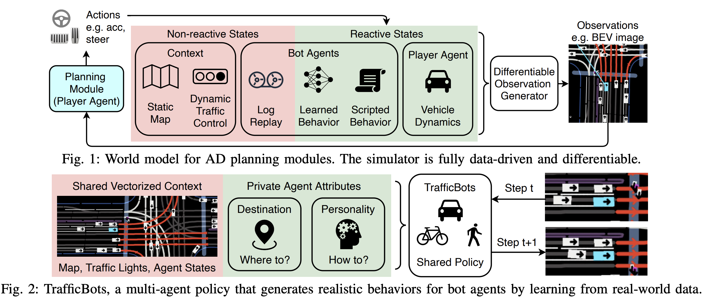

# TrafficBots: Towards World Models for Autonomous Driving Simulation and Motion Prediction

We are preparing the code release. Please check back later!

<p align="center">
  
</p>

This is the official code release of the paper <br> 
**[TrafficBots: Towards World Models for Autonomous Driving Simulation and Motion Prediction](https://arxiv.org/abs/2303.04116)** <br>
*by [Zhejun Zhang](https://zhejz.github.io/), [Alexander Liniger](https://alexliniger.github.io/), [Dengxin Dai](https://www.trace.ethz.ch/team/members/dengxin.html), [Fisher Yu](https://www.yf.io/) and [Luc van Gool](https://www.trace.ethz.ch/team/members/luc.html)*, accepted at [ICRA 2023](https://www.icra2023.org/). <br>

## Abstract
Data-driven simulation has become a favorable way to train and test autonomous driving algorithms. The idea of replacing the actual environment with a learned simulator has also been explored in model-based reinforcement learning in the context of world models. In this work, we show data-driven traffic simulation can be formulated as a world model. We present TrafficBots, a multi-agent policy built upon motion prediction and end-to-end driving, and based on TrafficBots we obtain a world model tailored for the planning module of autonomous vehicles. Existing data-driven traffic simulators are lacking configurability and scalability. To generate configurable behaviors, for each agent we introduce a destination as navigational information, and a time-invariant latent personality that specifies the behavioral style. To improve the scalability, we present a new scheme of positional encoding for angles, allowing all agents to share the same vectorized context and the use of an architecture based on dot-product attention. As a result, we can simulate all traffic participants seen in dense urban scenarios. Experiments on the Waymo open motion dataset show TrafficBots can simulate realistic multi-agent behaviors and achieve good performance on the motion prediction task.

## Citation
Please cite our work if you found it useful:
```
@inproceedings{zhang2023trafficbots,
  title = {{TrafficBots}: Towards World Models for Autonomous Driving Simulation and Motion Prediction},
  booktitle = {International Conference on Robotics and Automation (ICRA)},
  author = {Zhang, Zhejun and Liniger, Alexander and Dai, Dengxin and Yu, Fisher and Van Gool, Luc},
  year = {2023},
}
```

## License
This software is released under a CC-BY-NC 4.0 license, which allows personal and research use only. For a commercial 
license, please contact the authors. You can view a license summary here.

Portions of source code taken from external sources are annotated with links to original files and their corresponding 
licenses.

## Acknowledgements
This work was supported by Toyota Motor Europe and was carried out at the TRACE Lab at ETH Zurich (Toyota Research on 
Automated Cars in Europe - Zurich).